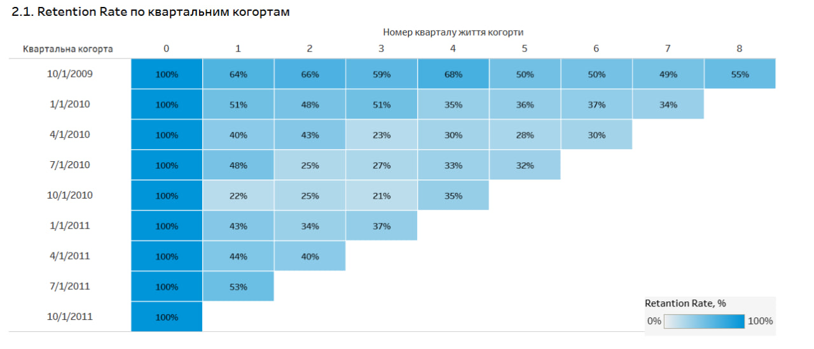
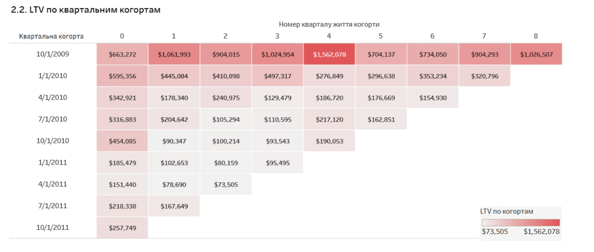
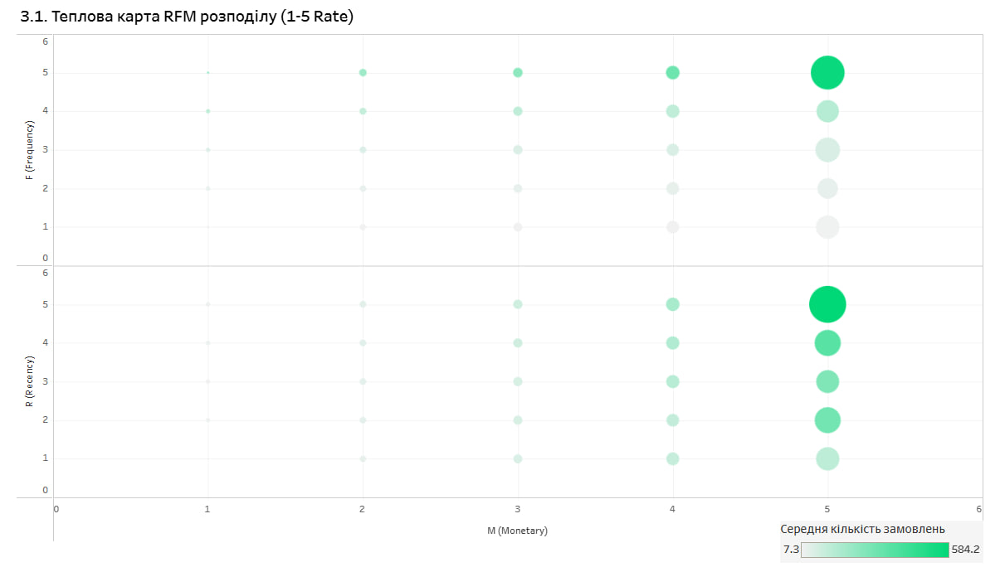

# Online-Retail-Dashboard

## Опис
Маємо клієнтську базу онлайн рітейлу з понад 1 млн спостережень: https://www.kaggle.com/datasets/mashlyn/online-retail-ii-uci/data

## Цілі:
- Провести когортний аналіз
- Знайти основні метрики продуктивності: Retention, LTV, ARPU
- Провести RFM-розподіл
- Отримані результати продемонструвати на дашборді

## Етапи:
1. SQL-етап: обробляю дані та пишу запити для отримання агрегованих даних, орієнтуючись на цілі проекту. Використовую CTE, JOIN, GROUP BY та інші команди. Результати зберігаю csv файлами.
2. Tableau-етап:
   - Завантажую результати запитів в Tableau середовище.
   - При необхідності обробляю дані в Tableau для потрібного формату та значень: створюю Calculated Field, змінюю типи даних.
   - На кожну візуалізацію створюю новий лист зі своїм джерелом агрегованих даних.
   - Об'єдную листи у дашборд. Оформляю.
  
## Результат
Повний дашборд можна переглянути за посиланням: https://public.tableau.com/app/profile/tymofiy.khorolskyy/viz/OnlineRetailDashboard_17622723359130/Dashboard1?publish=yes

